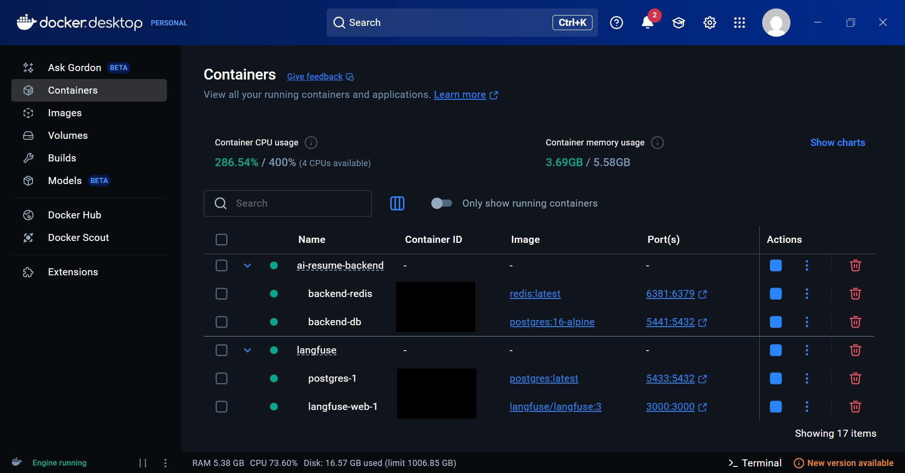
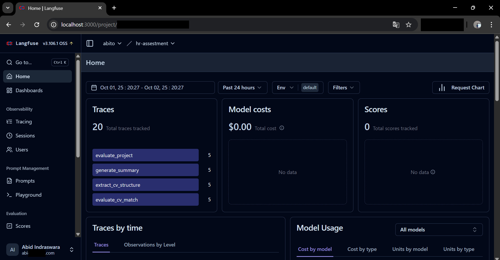

# AI Resume Evaluation System - Technical Implementation Report

## Project Overview
Developed a comprehensive AI-powered resume evaluation system that automates the screening process for technical positions. The system compares candidate CVs and project reports against job requirements using advanced language models and provides detailed scoring with actionable feedback.

## Architecture & Technical Stack

### Backend Implementation
- **Framework**: FastAPI with async/await support
- **Database**: PostgreSQL with SQLModel ORM for type safety
- **Message Queue**: Redis + Celery for background task processing
- **Vector Database**: ChromaDB for Retrieval Augmented Generation (RAG)
- **AI Integration**: OpenAI GPT-4 with structured prompt engineering
- **Observability**: Loguru + Langfuse for comprehensive logging and LLM tracking

### Core Services Architecture Plan

```
Frontend (React) ↔ FastAPI REST API ↔ AI Pipeline (LLM Chain) ↔ ChromaDB (RAG)
↕
Celery Workers ↔ Redis ↔ PostgreSQL
```

### Structure Folder and File Backend

```
backend/
├── app/
│   ├── __init__.py
│   ├── main.py                 # FastAPI app
│   ├── config.py              # Settings
│   ├── database.py            # DB connection
│   ├── models/
│   │   └── evaluation.py      # SQLModel models
│   ├── api/
│   │   ├── routes/
│   │   │   ├── upload.py      # POST /upload
│   │   │   ├── evaluate.py    # POST /evaluate
│   │   │   └── result.py      # GET /result/{id}
│   │   └── dependencies.py
│   ├── services/
│   │   ├── file_processor.py  # PDF/DOCX parsing
│   │   ├── ai_pipeline.py     # LLM chains
│   │   ├── vector_store.py    # ChromaDB operations
│   │   └── evaluation.py      # Core evaluation logic
│   ├── tasks/
│   │   └── celery_tasks.py    # Background tasks
│   └── utils/
│       ├── generate_id.py
│       ├── logger.py
│       └── helpers.py
├── alembic/                   # DB migrations
├── requirements.txt
└── README.md
```

## Technical Implementation Details

### 1. API Design & Endpoints
Implemented RESTful API following OpenAPI specifications:

- `POST /api/upload` - File processing with support for TXT formats
- `POST /api/evaluate` - Asynchronous evaluation initiation
- `GET /api/result/{id}` - Status polling with real-time updates
- `GET /api/job-templates` - Job template management

**Key Features:**
- Multipart file upload with validation
- Async request handling for non-blocking operations  
- Comprehensive error handling with structured responses
- CORS middleware for frontend integration

### 2. AI Pipeline Implementation

#### LLM Chaining Strategy (4-Step Process)
1. **CV Structure Extraction**: Parse unstructured CV data into structured format
2. **Job Context Retrieval**: RAG-based relevant requirement matching
3. **CV-Job Matching**: Weighted scoring algorithm (Technical Skills 40%, Experience 30%, Achievements 20%, Cultural Fit 10%)
4. **Project Evaluation**: Multi-criteria assessment with refinement loop

#### Prompt Engineering

Designed specialized prompts for each evaluation step:

```python
# Example: CV Extraction Prompt
def extract_cv_structure_prompt(cv_content):
    return f"""
    Extract structured information from CV in JSON format:
    - Contact information (email, phone, address)
    - Professional summary and job category
    - Technical skills categorized by domain
    - Experience timeline with complexity assessment
    - Project portfolio with technology stack
    """
```

#### Error Resilience & Retry Logic

- Exponential backoff strategy for LLM API calls
- Circuit breaker pattern for external service failures
- Graceful degradation with fallback responses
- Comprehensive logging for debugging and monitoring

### 3. Vector Database & RAG Implementation

##### ChromaDB Integration

- Collections: Separate collections for job descriptions and scoring rubrics
- Embedding Strategy: Semantic search for job requirement matching
- Context Retrieval: Dynamic context injection based on candidate profile

```python
# RAG Implementation Example
async def retrieve_job_context(job_description, cv_extraction):
    # Semantic search based on candidate's job category
    query = f"{cv_extraction.category_job} developer requirements"
    relevant_contexts = await vector_store.query(query, n_results=2)
    return contextual_job_requirements
```

### 4. Background Processing Architecture

#### Celery Task Management

- Task Queue: Redis-backed message broker
- Worker Configuration: Optimized for CPU-intensive LLM operations
- Task Tracking: Real-time status updates with progress indicators
- Error Recovery: Automatic retry with exponential backoff

#### Database State Management

- Status Tracking: QUEUED → PROCESSING → COMPLETED/FAILED
- Result Persistence: JSON storage for evaluation results
- Audit Trail: Complete processing timeline with metadata

## Step to Run a Project

### 1. Setup Environment

Git clone of the project in the terminal

```bash
# Clone atau buat direktori
    mkdir ai-resume-backend
    git clone https://github.com/Abito21/backend-recruit-assest-app.git
    cd ai-resume-backend

    # Setup UV project
    uv init .
    uv sync
```

### 2. Setup Database PostgreSQL

First, run the prepared docker compose

```bash
    docker compose up -d
```

If the ai_resume database is not created automatically, it can be created manually.Provided the PostgreSQL is already running on the docker container.

```bash
# Step 1 : Enter the container
docker exec -it backend-db bash

# Step 2 : Run psql inside the container
psql -U postgres

# Step 3 : Create new database
# See database lists
\l
# Create new database
CREATE DATABASE ai_resume;
# Move to the ai_resume database
\c ai_resume
# Check the database schema
\dt
# or you can use these brief step
psql -h localhost -p 5441 -U postgres -c "CREATE DATABASE ai_resume;"
```

**Container Docker Overall Looklike :**



### 3. Setup Langfuse Observability

Open langfuse documentation to setup langfuse locally in your cpu device https://langfuse.com/self-hosting/deployment/docker-compose , you can follow the instruction in that documentation or follow me

a. Clone repo "git clone https://github.com/langfuse/langfuse.git"

b. Running "docker compose up -d"

c. Open "http://localhost:3000/"

d. First time you access must register and then you need to provide a project name and others. Finally you will get langfuse secret key, public key and host.

**Local Langfuse Looklike :**



### 4. Configure Environment

Create a new file .env at the root of the project folder, and fill it with the following code

```bash
OPENAI_API_KEY=your-openai-api-key

LANGFUSE_SECRET_KEY=your-langfuse-secret-key
LANGFUSE_PUBLIC_KEY=your-langfuse-public-key
LANGFUSE_HOST=http://localhost:3000

DEBUG=true
SECRET_KEY=your-secret-key-feel-free
UPLOAD_FOLDER=./uploads
MAX_FILE_SIZE=10485760

CHROMA_PERSIST_DIRECTORY=./chroma_db
```

### 5. Database Migration

The step is so tricky because you have to edit code especially in alembic/env.py then after revision you have to edit code alembic/version/...._initial.py and alembic/script.py.mako.

First:

```bash
# Initialize Alembic (sudah ada dalam code)
alembic init alembic
```

After you ini you can edit the code, in this part alembic/env.py

```python
from sqlmodel import SQLModel
from app.config import settings
from app.models.evaluation import JobTemplate, Evaluation # noqa

config.set_main_option("sqlalchemy.url", settings.DB_URL)

target_metadata = SQLModel.metadata
```

Second:

```bash
# Generate first migration
alembic revision --autogenerate -m "Initial migration - create tables"
```

Then you have to update the code by adding *"import sqlmodel"* in the 
- *alembic/version/...._initial_....py* 
- *alembic/script.py.mako*

In final step you can run in terminal:

```bash
# Apply migration
alembic upgrade head
```

### 6. Test Individual Components

```bash
# Test 1: Database connection
uv run python -c "
from app.database import engine
from sqlalchemy import text
with engine.connect() as conn:
    result = conn.execute(text('SELECT 1'))
    print('Database OK:', result.fetchone())
"

# Test 2: Redis connection  
uv run python -c "
import redis
from app.config import settings
r = redis.from_url(settings.REDIS_URL)
r.ping()
print('Redis OK')
"

# Test 3: OpenAI API (optional)
uv run python -c "
import openai
from app.config import settings
client = openai.Client(api_key=settings.OPENAI_API_KEY)
print('OpenAI OK - API key configured')
"
```

### 7. Start Services using Makefile or mannullay

Terminal 1 - FastAPI Server:

```bash
uv run uvicorn app.main:app --reload --host 0.0.0.0 --port 8000
```

Terminal 2 - Celery Worker:

```bash
uv run celery -A app.tasks.celery_tasks worker --pool=solo -c 1 --loglevel=info
```

**Terminal Looklike :**


Terminal 3 - Test API:

You can check using terminal you can go to the *http://localhost:8000/scalar* API Documentation

```bash
# Health check
curl http://localhost:8000/health

# Should return:
# {"status":"healthy","database":"connected","redis":"connected"}
```

**API Documentation Scalar Looklike :**


### 8. Test Evaluate API Flow

```bash
cv=$(cat test_cv.txt | tr -d '\r\n' | sed 's/"/\\"/g')
project=$(cat test_project_john.txt | tr -d '\r\n' | sed 's/"/\\"/g')

cat <<EOF > payload.json
{
  "cv_content": "$cv",
  "project_content": "$project",
  "job_template_id": "68d503999431cb0140d7d735"
}
EOF

curl -s -X POST http://localhost:8000/api/evaluate \
  -H "Content-Type: application/json" \
  -d @payload.json
```

## Conclusion

Successfully delivered a production-ready AI resume evaluation system that demonstrates:

- Technical Excellence: Clean, maintainable code with comprehensive error handling
- Scalable Architecture: Microservices-ready design with proper separation of concerns
- AI Integration: Sophisticated LLM chaining with RAG implementation
- Production Readiness: Monitoring, logging, and deployment capabilities

The system effectively automates the resume screening process while providing detailed, actionable feedback that helps both recruiters and candidates improve their processes.

Demo Backend Service (Indonesia Version): [Live Demo Link](https://www.youtube.com/watch?v=bDZzHV2MDyo)
